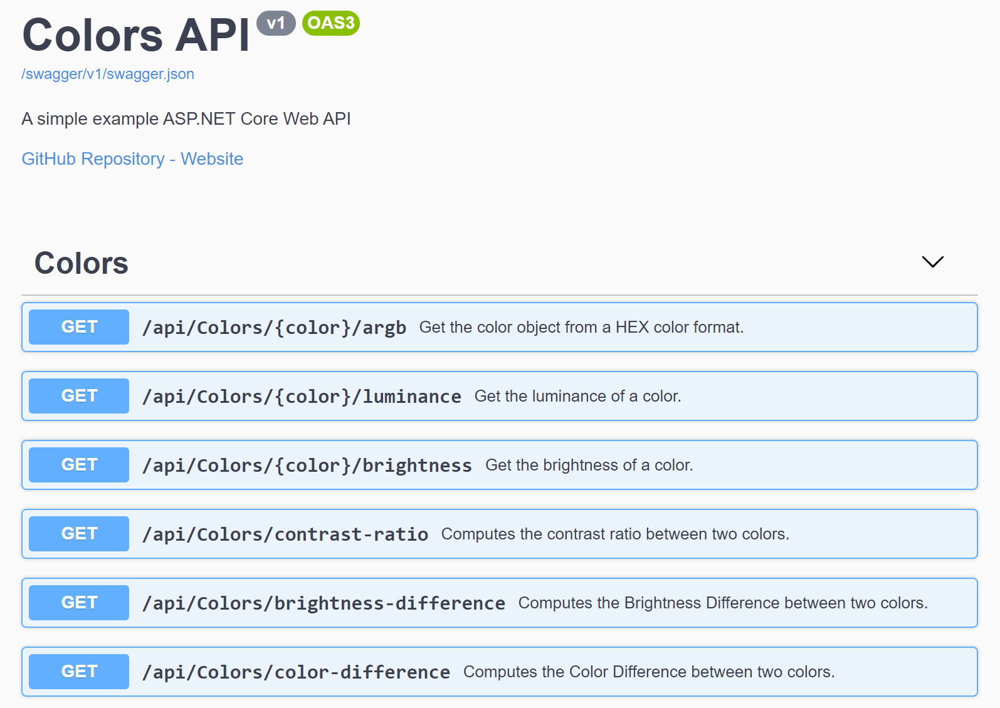

# Dockerized ASP.NET Core 3 Web API app in Heroku

## [Medium Article 1: Deploy a Dockerized ASP.NET Core 3 Web API app to Heroku](https://codeburst.io/deploy-a-containerized-asp-net-core-app-to-heroku-using-github-actions-9e54c72db943)

In this blog post, we will create a containerized ASP.NET Core 3.1 Web API project, and set up a CI/CD pipeline using GitHub Actions. In the GitHub workflow, we will build and test the Web API project, and deploy the final docker image to Heroku.

## [Medium Article 2: Get Started with Swashbuckle and ASP.NET Core](https://codeburst.io/get-started-with-swashbuckle-and-asp-net-core-fd3a75350aac)

This article is intended to add some supplementary information to the official documentation in Microsoft Docs. My goal is to connect the dots between the code/comments and the Swagger UI elements.

## [Medium Article 3: File Upload via Swagger](https://codeburst.io/file-uploading-in-swagger-e6c21b54d036)

In this article, we will go over examples about uploading a single file, uploading a list of files, and uploading a file in a FormData object.

---

## [API Website](https://icolors.herokuapp.com)

