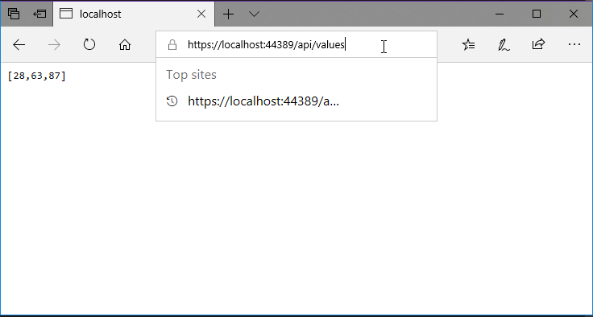
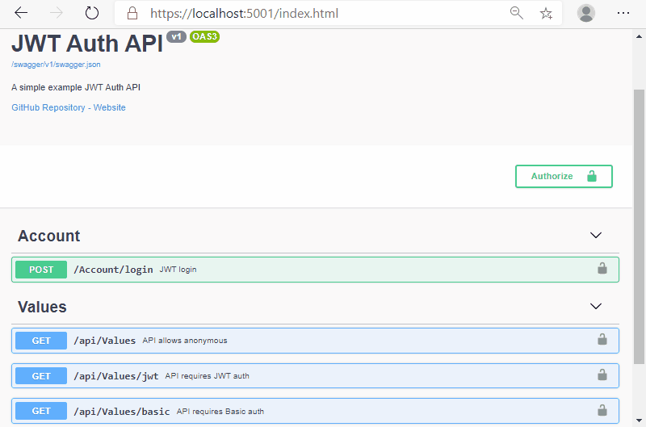

# JWT auth demo and Basic auth demo

This repository demos a Web API project that is configured to use JWT authentication globally, and some action methods can be configured to use Basic Auth using an attribute.

## Medium Articles

[Basic Authentication](https://codeburst.io/adding-basic-authentication-to-an-asp-net-core-web-api-project-5439c4cf78ee)

## Screen recordings

### Screen recording for an API with Basic Authentication

### Screen recording for API authentication in Swagger UI

