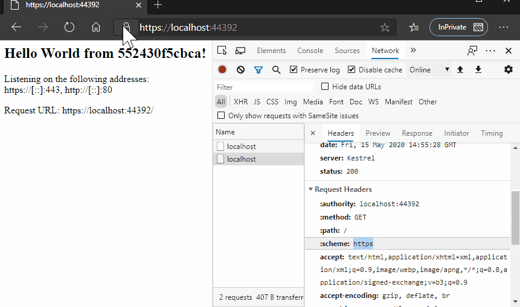
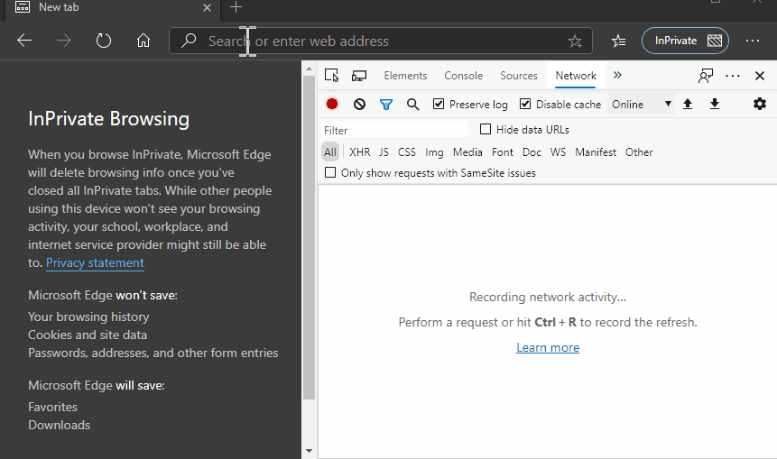

# Enforce HTTPS for an ASP.NET Web API hosted in Kestrel

Kestrel used as an edge (Internet-facing) web server.

## [Medium Article: Hosting an ASP.NET Core App on Docker with HTTPS](https://codeburst.io/hosting-an-asp-net-core-app-on-docker-with-https-642cde4f04e8)

## Configure Kestrel

[Documentation in Microsoft Docs](https://docs.microsoft.com/en-us/aspnet/core/fundamentals/servers/kestrel)

Kestrel used as an edge server without a reverse proxy server doesn't support sharing the same IP and port among multiple processes. When Kestrel is configured to listen on a port, Kestrel handles all of the traffic for that port regardless of requests' Host headers.

### Kestrel options

- Maximum request body size
  The default maximum request body size is 30,000,000 bytes, which is approximately 28.6 MB.

  The recommended approach to override the limit in an ASP.NET Core MVC app is to use the `RequestSizeLimitAttribute` attribute on an action method:

  ```csharp
  [RequestSizeLimit(100 * 1024 * 1024)]
  public IActionResult MyActionMethod()
  ```

- Minimum request body data rate

  Kestrel checks every second if data is arriving at the specified rate in bytes/second. If the rate drops below the minimum, the connection is timed out. The grace period is the amount of time that Kestrel gives the client to increase its send rate up to the minimum; the rate isn't checked during that time. The grace period helps avoid dropping connections that are initially sending data at a slow rate due to TCP slow-start.

  The default minimum rate is 240 bytes/second with a 5 second grace period.

  A minimum rate also applies to the response. The code to set the request limit and the response limit is the same except for having RequestBody or Response in the property and interface names.

- Request headers timeout

  Gets or sets the maximum amount of time the server spends receiving request headers. Defaults to 30 seconds.

## Build an ASP.NET Core Web App on Docker

```bash
# in this directory
docker compose build
docker compose up
```

```bash
# in this directory
docker build . -t aspnetapp
docker run -it -p 5000:5000 aspnetapp
docker run --rm -it \
    -p 5000:5000 -p 5001:5001 \
    -e ASPNETCORE_URLS="https://+;http://+" \
    -e ASPNETCORE_HTTPS_PORT=5001 \
    -e ASPNETCORE_Kestrel__Certificates__Default__Password="mypassword123" \
    -e ASPNETCORE_Kestrel__Certificates__Default__Path=//https/aspnetapp.pfx \
    -v /$PWD/https/aspnetapp.pfx://https/aspnetapp.pfx \
    aspnetapp

```

---

- Check Certificate



- HTTPS Redirect


