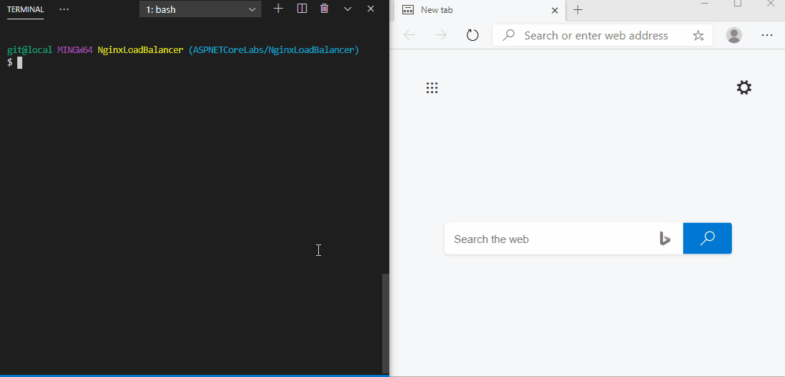

# Host an ASP.NET Core App with Nginx and Docker: SSL and Load Balancing

## [Medium Article](https://codeburst.io/load-balancing-an-asp-net-core-web-app-using-nginx-and-docker-66753eb08204)

Following the two articles, _[Configure ASP.NET Core to work with proxy servers and load balancers](https://docs.microsoft.com/en-us/aspnet/core/host-and-deploy/linux-nginx?view=aspnetcore-3.1#configure-nginx)_ and _[Host ASP.NET Core on Linux with Nginx](https://docs.microsoft.com/en-us/aspnet/core/host-and-deploy/linux-nginx?view=aspnetcore-3.1)_, in Microsoft Docs, I created a demo application using Docker Compose, which orchestrates an Nginx reverse proxy server and an ASP.NET Core Web API app. The following screen recording shows the demo app.



## Load Balancing

```bash
docker-compose build
docker-compose up --scale api=4 --build
docker-compose up
```

## SSL

### Generate an OpenSSL certificate

On Windows, if you have _Git for Windows_ installed, then you can use the `openssl` command directly. Otherwise, the official page: [OpenSSL.Wiki: Binaries](https://wiki.openssl.org/index.php/Binaries) contains useful URLs for downloading and installation guides.

```bash
openssl req -x509 -nodes -days 365 -newkey rsa:2048 -keyout localhost.key -out localhost.crt -passin pass:YourSecurePassword
```

This command will generate two files: `localhost.crt` and `localhost.key`.
