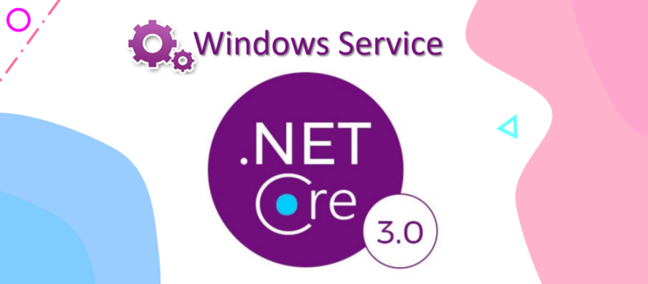

# Windows Service in ASP.NET Core

## [Medium Article](https://codeburst.io/create-a-windows-service-app-in-net-core-3-0-5ecb29fb5ad0)

In this blog post, we will create a demo Windows Service application which includes a set of features such as reading configurations, logging to files, dependency injection, file system watcher, and so on. The application will be written in .NET Core 3, which introduces new concepts like generic host, worker service, background service, and so on. We will go over the installation process of our Windows Service application as well.
