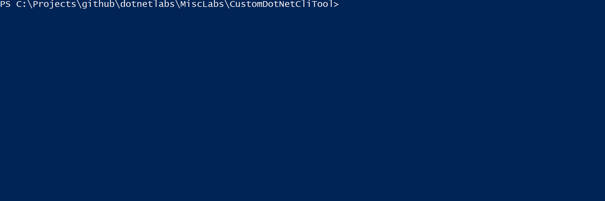

# .NET Core Global Tools

## [Medium Article]()

This blog post discusses

## Build Locally

You can build this project locally either using Docker or using .NET CLI tools.

### 1. using Docker with Linux containers



```PowerShell
docker build -t global-tool-test .
docker run -it global-tool-test bash
root@7a5df30fefaa:/src/tools# ./stat sd -n 1 2 3
Population Standard Deviation: 0.816496580927726
    Sample Standard Deviation: 1
root@7a5df30fefaa:/src/tools# ./stat avg -n 1 2 3
Arithmetic Average: 2
root@7a5df30fefaa:/src/tools# exit
# can rebuild the project using bash commands in the container
```

### 2. using `dotnet cli`

```PowerShell
cd StatisticsToolbox
dotnet pack
dotnet tool install --add-source .nuget\ stat --tool-path .\tools
dotnet tool update --add-source .nuget\ stat --tool-path .\tools
.\tools\stat.exe avg  -n 1
.\tools\stat.exe sd  -n 1 2 3
```
