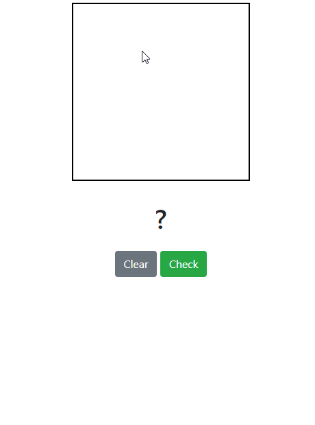

# Handwriting Recognition using ML.NET

## [Demo Website](https://ml-recognition.herokuapp.com/)

## [Medium Article](https://codeburst.io/handwriting-recognition-using-ml-net-3ce23a7369af)

ML.NET is a cross-platform machine learning framework which provides state-of-art machine learning algorithms, transforms and components. ML.NET allows .NET developers to develop/train models and integrate machine learning with their .NET applications, even without prior expertise of tuning machine learning models.

In this blog post, we will make a web application to recognize handwriting numbers using ML.NET. The [demo web app](https://ml-recognition.herokuapp.com/) is running in a Linux container, which demonstrates the cross-platform capability of ML.NET and ASP.NET Core.

