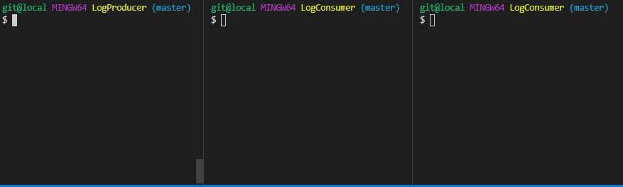

# RabbitMQ on Docker Starter: Server-named Queues

```Docker
# interactively
docker run --rm -it --hostname my-rabbit -p 15672:15672 -p 5672:5672 rabbitmq:3-management

# detached
docker run --rm -d --hostname my-rabbit -p 15672:15672 -p 5672:5672 rabbitmq:3-management
```

## Demo

A basic pub/sub model with one message producer and two consumers. Each consumer uses a server-named queue. Exchange type is `Fanout`.



## Server-named Queues

In `AMQP 0-9-1`, the broker can generate a unique queue name on behalf of an app. To use this feature, pass an empty string as the queue name argument: The same generated name may be obtained by subsequent methods in the same channel by using the empty string where a queue name is expected. This works because the channel remembers the last server-generated queue name.

## Exclusive Queues

An exclusive queue can only be used (consumed from, purged, deleted, etc) by its declaring connection. `channel.QueueDeleteNoWait(queueName)` or `channel.QueueDelete(queueName)`. An attempt to use an exclusive queue from a different connection will result in a channel-level exception `RESOURCE_LOCKED` with an error message that says `cannot obtain exclusive access to locked queue`.

Exclusive queues are deleted when their declaring connection is closed or gone (e.g. due to underlying TCP connection loss). They therefore are only suitable for client-specific transient state.

It is common to make exclusive queues server-named.
