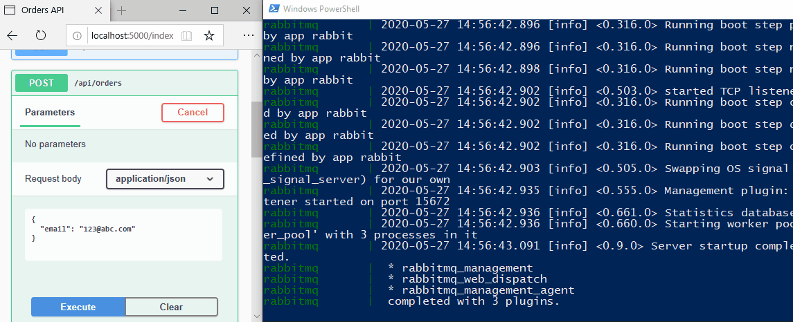

# RabbitMQ on Docker Starter: Multi-Containers

```Docker
docker-compose build
docker-compose up

```

## Demo

A basic pub/sub model with a message producer (a Web API app) and a consumer (a Worker Service app).

```bash
# RabbitMQ management website logins
admin:admin123 (admin account)
ops0:ops0 (msg producer account)
ops1:ops1 (msg consumer account)
```


